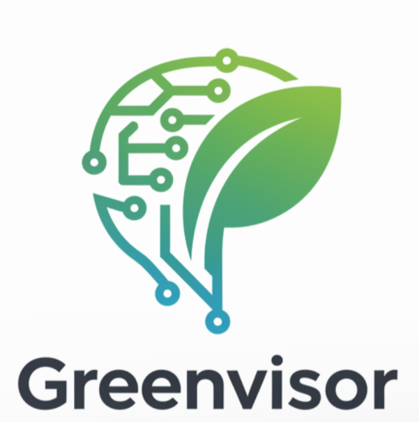

<h1 align="center">Greenvisor</h1>

  

**Version:** 0.0.1
**Last Updated:** May 10, 2025

## Description

Greenvisor is an AI-powered energy consultation application designed to provide advice on home renovations for energy efficiency, with a focus on the German context. It leverages Large Language Models (LLMs) to answer user questions, considering German laws, government subsidies, and potential cost savings. The application can interact with a Neo4j graph database for retrieving contextual information and can export data to PDF format.
2

## Features

* **AI-Powered Energy Consultation:** Provides tailored advice on home energy renovations.
* **German Context-Specific:** Considers German laws (e.g., GEG §72), subsidies, and common renovation practices.
* **Structured JSON Output:** Delivers renovation suggestions in a predefined JSON format, detailing measures, costs, savings, CO2 impact, subsidies, and legal obligations.
* **Multi-Language Support:** Capable of understanding prompts and delivering answers in different languages (e.g., English, German).
* **Graph Database Integration:** Utilizes a Neo4j graph database to fetch relevant data and context for answering user queries.
* **PDF Export Functionality:** Allows for the export of data (presumably consultation results or reports) into PDF files.
* **Modular Design:** Built with FastAPI for the API layer and Langchain for LLM interactions.