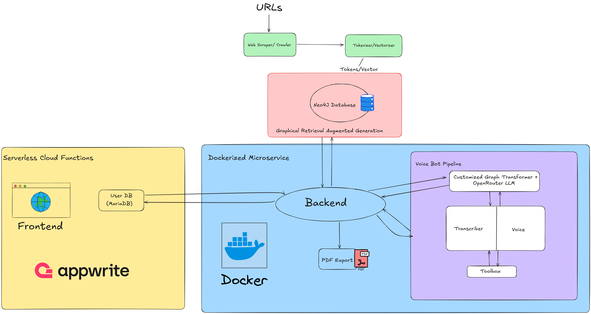

## Core Components

The backend of the project is structured around several key Python modules and functionalities:

* **`main.py` (root):**
  * Initializes the main FastAPI application.
  * Configures CORS middleware.
  * Includes API routers from `graph_db.app` and `pdf_export.app`.
  * Defines the root (`/`) endpoint for basic health check.

* **`graph_db/app.py` (API Router mounted at `/graph`):**
  * Defines the `/query` endpoint:
    * Accepts a `QueryRequest` (question and language).
    * Uses `utils.query.combined_llm_response` to generate an answer by querying the Neo4j graph and leveraging LLMs.
  * Defines the `/process-folder/{folder_path:path}` endpoint:
    * Takes a folder path (relative to a base data directory, e.g., `./data/`).
    * Uses `graph_db.vectorizer.process_and_store_documents_async` to ingest text documents from the specified folder.

* **`graph_db/vectorizer.py`:**
  * `load_text_documents_async`: Asynchronously loads `.txt` files from a given folder.
  * `convert_docs_to_graph`: Uses `utils.llm.OpenRouterGraphTransformer` to convert a document into its graph representation (nodes and relationships).
  * `process_and_store_documents_async`: Orchestrates the entire pipeline of loading text documents, transforming them into graph documents using an LLM (e.g., `openai/gpt-4.1` via OpenRouter) guided by `ALLOWED_NODES` and `ALLOWED_RELATIONSHIPS`, pickling the results, and finally storing them in the Neo4j database.

* **`pdf_export/app.py` (API Router mounted at `/pdf`):**
  * Defines the `/export` endpoint that uses the `json_to_pdf` function from `pdf_export.pdfexport`.

* **`pdf_export/pdfexport.py`:**
  * `json_to_pdf`: Converts a Python dictionary (expected to represent tabular data) into an HTML table with specific styling, and then renders this HTML to a PDF file using `pdfkit` (which wraps `wkhtmltopdf`).

* **`utils/llm.py`:**
  * `OpenRouterGraphTransformer`: A custom Langchain `LLMGraphTransformer` subclass. It's configured to use an LLM via `utils.query.ChatOpenRouter` for transforming text documents into graph structures (nodes and relationships).

* **`utils/prompt.py`:**
  * `custom_prompt`: A Langchain `PromptTemplate` that structures the input for the final LLM call in the Q&A process. It guides the AI to act as an energy advisor, consider various aspects (actions, costs, subsidies, etc.), and use provided context from the graph and user. Includes example interactions.
  * `cypher_chain_prompt`: A Langchain `PromptTemplate` used to instruct an LLM on how to generate Cypher queries for Neo4j based on a natural language question and available node types.
  * `prompt_en` & `prompt_de`: Specific prompt examples (though `custom_prompt` seems to be the primary one used in `combined_llm_response`). These define the persona of an AI home energy consultant in Germany and the expected JSON output for renovation advice.

* **`utils/query.py`:**
  * `ChatOpenRouter`: A custom Langchain `ChatOpenAI` wrapper that configures the base URL and API key to use models from OpenRouter.ai.
  * `initialize_query_chain`: A function that sets up a Langchain `GraphCypherQAChain`. This chain connects to the Neo4j graph and uses two LLM instances (via `ChatOpenRouter`): one for Cypher query generation (e.g., `anthropic/claude-3.7-sonnet`) and another for generating an answer from the graph results (e.g., `openai/gpt-4.1`).
  * `combined_llm_response`: The core function for handling user queries. It orchestrates fetching data from Neo4j using `GraphCypherQAChain` and then passes this context, along with the user's question and other parameters, to another LLM (e.g., `anthropic/claude-3.7-sonnet`) formatted by `utils.prompt.custom_prompt`.

* **`models/query.py`:**
  * `QueryRequest`: A Pydantic model defining the expected JSON structure for requests to the `/graph/query` endpoint, containing `question` (str) and `lang` (str).

## API Endpoints

The following API endpoints are exposed by the Greenvisor application:

* **`GET /`**:
  * Description: Root endpoint of the API.
  * Response: `{"Hello"}`
* **`POST /graph/query`**:
  * Description: Receives a user's question and language preference, queries the knowledge graph, and returns an AI-generated answer.
  * Request Body: `{ "question": "string", "lang": "string" }`
  * Response: `{ "message": "AI generated answer string" }`
* **`POST /graph/process-folder/{folder_path:path}`**:
  * Description: Processes all `.txt` files in the specified subfolder under the application's `BASE_DATA_DIR` (e.g., `./data/your_folder`), converts them to graph documents, and stores them in Neo4j.
  * Path Parameter: `folder_path` (e.g., `my_documents`)
  * Response: `{ "message": "Successfully processed folder: /path/to/data/your_folder" }` or an error detail.
* **`GET /pdf/export`**:
  * Description: Exports provided JSON data to a PDF file.
  * Query Parameters:
    * `data` (dict): The JSON data to be converted to PDF (passed as a query string, which might be complex for large data; consider POST with a request body for actual implementation).
    * `output_path` (str): The server-side file path where the generated PDF should be saved.
  * Response: `{ "message": "PDF generated successfully", "output_path": "path_to_pdf" }`
* **`GET /docs`**:
  * Description: Provides access to the FastAPI automatically generated API documentation (Swagger UI).

## Technology Stack

* **Backend Framework:** FastAPI
* **Data Validation:** Pydantic
* **LLM Orchestration:** Langchain, Langchain Experimental (Graph Transformers)
* **LLM Access:** OpenAI (models like GPT-4.1), Anthropic (models like Claude 3.7 Sonnet) - via OpenRouter.ai
* **Database:** Neo4j (Graph Database)
* **PDF Generation:** `pdfkit` (wrapper for `wkhtmltopdf`), `pandas`
* **Asynchronous Programming:** `asyncio`, `aiofiles`, `tqdm.asyncio`
* **Environment Management:** python-dotenv
* **Containerization:** Docker, Docker Compose
* **Programming Language:** Python 3.11

## Setup and Installation

### Docker

**Method 1: Using Docker Compose (Recommended)**

This method uses the `docker-compose.yml` file to manage the application service, including building the image and linking the `.env` file.

1. **Navigate to the project root directory** in your terminal.
2. **Build and start the application:**

    ```bash
    docker-compose up
    ```

    For newer Docker versions:

    ```bash
    docker compose up
    ```

    This will show application logs in your terminal. To stop, press `Ctrl+C`.

3. **To run in detached (background) mode:**

    ```bash
    docker-compose up -d
    ```

    Or:

    ```bash
    docker compose up -d
    ```

4. **To stop the application (if running in detached mode or from another terminal):**

    ```bash
    docker-compose down
    ```

    Or:

    ```bash
    docker compose down
    ```

**Method 2: Building and Running a Docker Image Manually**

This method involves building the Docker image first and then running it directly.

1. **Navigate to the project root directory** in your terminal.
2. **Ensure your `.env` file is present** in the project root, as it will be needed by the running container.
3. **Build the Docker image:**
    Replace `greenvisor:latest` with your desired image name and tag.

    ```bash
    docker build -t greenvisor:latest .
    ```

4. **Run the Docker container from the image:**
    This command maps port 8000 of the container to port 8000 on your host machine and passes the `.env` file to the container.

    ```bash
    docker run -p 8000:8000 --env-file .env greenvisor:latest
    ```

    * If you prefer not to use `--env-file` (e.g., for security reasons in some environments or if your Docker version has issues with it), you would need to pass each environment variable individually using the `-e` flag:

        ```bash
        docker run -p 8000:8000 \
          -e OPENROUTER_API_KEY="your_key" \
          -e NEO4J_URI="your_uri" \
          -e NEO4J_USERNAME="your_user" \
          -e NEO4J_PASSWORD="your_password" \
          greenvisor:latest
        ```

**Accessing the Application:**

Once the application is running using either method, it should be accessible at:
`http://localhost:8000`

### Locally

1. **Create and activate a virtual environment:**

    ```bash
    python -m venv venv
    source venv/bin/activate  # On Windows: venv\Scripts\activate
    ```

2. **Install dependencies:**

    ```bash
    pip install -r requirements.txt
    ```

3. **Set up environment variables:**
    Create a `.env` file in the root directory and add the necessary keys (see [Environment Variables](#environment-variables)).
4. **Run the Neo4j database instance.**
5. **Run the FastAPI application:**

    ```bash
    uvicorn main:app --reload


## Environment Variables

The application requires the following environment variables to be set (e.g., in a `.env` file):

* `OPENROUTER_API_KEY`: Your API key for OpenRouter.ai.
* `NEO4J_URI`: The URI for your Neo4j database instance (e.g., `bolt://localhost:7687`).
* `NEO4J_USERNAME`: The username for your Neo4j database.
* `NEO4J_PASSWORD`: The password for your Neo4j database.
* (Potentially other keys for specific OpenAI models if not accessed via OpenRouter exclusively)

## How it Works (High-Level Example: Getting Energy Advice)

### 1. Data Ingestion (Knowledge Graph Population)

* Text documents (.txt files) containing information relevant to energy advising (e.g., funding programs, technical specifications, legal texts) are placed in a sub-directory within the `./data/` folder (e.g., `./data/kfw_programs/`).
* A `POST` request is made to the `/graph/process-folder/{subfolder_name}` endpoint.
* The backend service (`graph_db/vectorizer.py`) reads these documents, uses an LLM via `OpenRouterGraphTransformer` to extract structured information as graph nodes and relationships (guided by `ALLOWED_NODES` and `ALLOWED_RELATIONSHIPS`), and populates the Neo4j database.

### 2. Answering User Queries

* A user poses a question related to energy renovation through an API client or a frontend application, targeting the `/graph/query` endpoint. The request includes the question and preferred language.
* The `utils/query.py` module handles the request:
  * `initialize_query_chain` sets up a `GraphCypherQAChain`.
  * This chain first converts the natural language question into a Cypher query for Neo4j using an LLM.
  * The Cypher query fetches relevant context from the Neo4j knowledge graph.
  * The retrieved context, along with the original question, is then passed to another LLM, formatted by `utils.prompt.custom_prompt`.
  * This final LLM generates a comprehensive answer, acting as an AI energy advisor.
* The answer is returned to the user.


